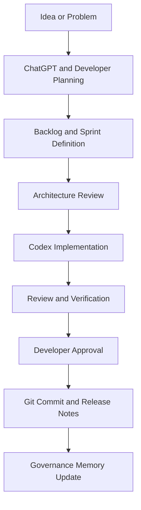

# AI Agent Workflow

## Roles

- **Developer:** Product owner, local tester, final approver, and release authority.
- **ChatGPT:** Planning, architecture review, prompt design, and product discussion.
- **Codex:** Focused implementation, verification, documentation, and engineering reports.
- **CreatorForge:** The product context, architecture, governance documents, and codebase shared by all participants.

## Workflow

## Planning

Define the user value, scope, acceptance criteria, allowed files, compatibility requirements, and whether architecture approval is necessary.

## Implementation

Codex reads the required governance context, explains file scope, implements only approved work, and avoids unrelated refactors.

## Review

Review contracts, creator-facing behavior, architecture boundaries, focused verification, and remaining debt.

## Approval

The developer approves scope changes, architectural changes, releases, destructive actions, and external integrations.

## Git

Use focused commits with clear messages after testing and approval. Do not commit outputs, secrets, or unrelated working-tree changes.

## Release

Update release notes, changelog, roadmap, current sprint status, and AI memory when a sprint is completed.
