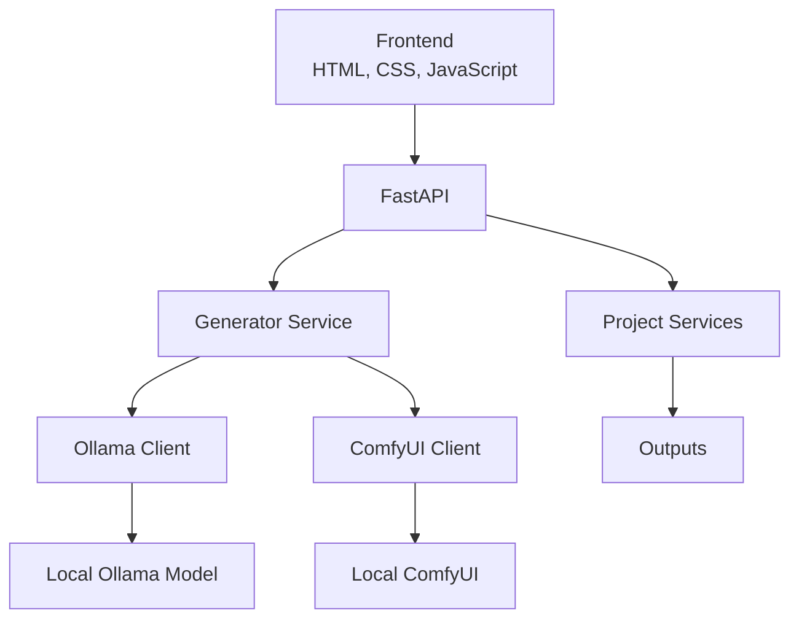
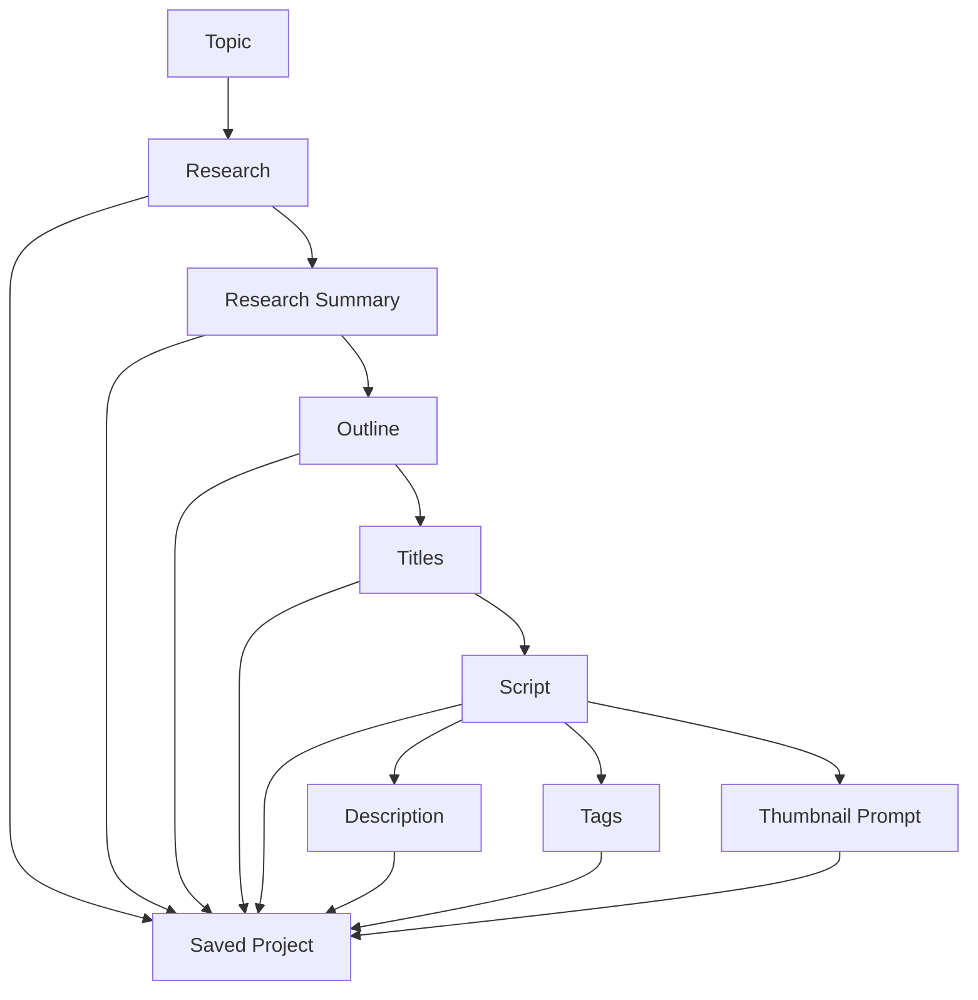

# CreatorForge Architecture

## System Overview

## Generation Flow

## Layers

### Frontend

The static HTML, CSS, and JavaScript studio collects a topic and model, requests generation, displays project artifacts, polls generation progress, and opens saved projects. It contains no filesystem access.

### FastAPI

`backend/main.py` exposes thin API routes, validates request models, coordinates existing services, maps known errors, and keeps in-memory generation progress for the current process.

### Generator Service

`backend/services/generator.py` owns generation orchestration at the content domain level. It builds shared prompt context, calls the Ollama client, and applies lightweight output cleanup.

### Ollama Client

`backend/ollama.py` is the provider boundary. It reads model configuration, validates supported models, and sends prompt requests to local Ollama.

### ComfyUI Client

`backend/services/comfyui_client.py` is the sole REST boundary for local
ComfyUI image generation. `image_service.py` owns image-scene orchestration and
project artifact persistence.

### Project Services

`project_saver.py` persists generated artifacts and project metadata. `project_service.py` lists and opens projects, including graceful fallbacks for legacy project files.

### Media Services

`image_service.py` plans, regenerates, and persists project visual artifacts;
`video_service.py` coordinates local FFmpeg rendering and optional subtitle or
music inputs; `youtube_service.py` coordinates explicit uploads and persists a
non-secret upload receipt.

### Outputs

`outputs/` contains one folder per saved project, with `project.json` and human-readable artifact files. It is application data, not source code.

## Architectural Rules

- Keep routes thin.
- Keep generation behavior in `generator.py`.
- Keep project filesystem behavior in project services.
- Keep model/provider access in the Ollama client.
- Do not refactor the frozen backend architecture without an approved reason.

See [Decisions](DECISIONS.md) and [AI Context](AI_CONTEXT.md).
