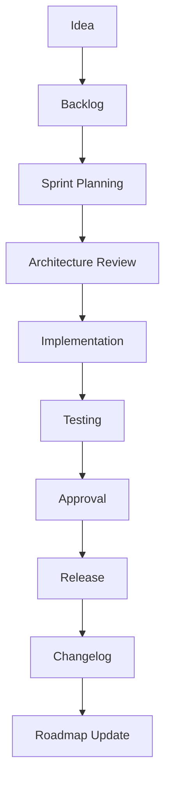

# Feature Lifecycle

## Idea

Capture the creator problem and intended user value.

## Backlog

Record unprioritized work in [Backlog](BACKLOG.md).

## Sprint Planning

Define scope, acceptance criteria, compatibility needs, allowed files, and verification.

## Architecture Review

Check [Architecture](ARCHITECTURE.md) and [Decisions](DECISIONS.md). Seek approval before any change that affects the frozen architecture.

## Implementation

Extend existing modules, preserve contracts, and keep work focused.

## Testing

Follow [Testing Strategy](TESTING_STRATEGY.md) with mocks where practical.

## Approval

The developer validates creator-facing behavior and approves completion.

## Release

Prepare the selected version and release notes.

## Changelog

Record completed work in [Changelog](CHANGELOG.md).

## Roadmap Update

Mark milestones and next priorities in [Roadmap](ROADMAP.md).
