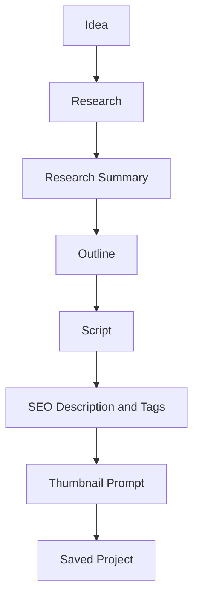
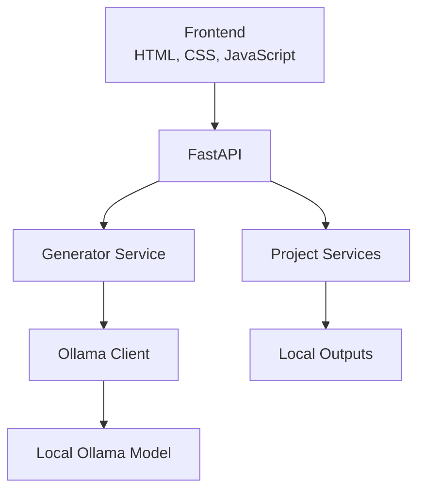

# 🚀 CreatorForge

The Local AI Content Operating System

CreatorForge is a local-first AI content studio that turns one topic into a complete YouTube content project using Ollama. Generate research, a distilled research summary, an outline, titles, script, description, tags, and a thumbnail prompt—then save and reopen every project on your own machine.


## Why CreatorForge?

Most AI content tools send creator ideas, research, and drafts to remote services. CreatorForge takes a local-first approach: your workflow runs with local Ollama models, your generated projects are stored locally, and you keep control over the creative process.

The goal is bigger than one-off text generation. CreatorForge is becoming a creator operating system: a practical workspace that helps creators move from idea to research-led, reusable content while keeping AI transparent and human-directed.

## Core Features

| Capability | Status | What it does |
|---|---:|---|
| Research | ✅ | Generates structured, creator-focused research. |
| Research Summary | ✅ | Distills research before downstream generation. |
| Outline | ✅ | Builds a detailed YouTube structure. |
| Titles | ✅ | Produces high-CTR title options. |
| Script | ✅ | Generates a context-aware video script. |
| Description | ✅ | Produces an SEO-focused YouTube description. |
| Tags | ✅ | Creates comma-separated YouTube tags. |
| Thumbnail Prompt | ✅ | Produces one image-generation prompt. |
| Project History | ✅ | Saves, lists, and reopens local projects. |
| Progress Tracking | ✅ | Shows live generation stages. |
| Multi-model | ✅ | Uses supported local Ollama models. |

## How CreatorForge Works



## Architecture



```text
Topic → Research → Research Summary → Outline → Titles → Script
      → Description → Tags → Thumbnail Prompt → Saved Project
```

### Media Architecture

```text
FastAPI routes -> image_service -> comfyui_client -> local ComfyUI
FastAPI routes -> video_service -> local FFmpeg
FastAPI routes -> youtube_service -> official YouTube API OAuth
                         |
                    project artifacts in outputs/
```

The original no-body voice, image, video, and upload routes remain available.
New media controls are optional and creator-initiated.

## Screenshots

Screenshots are coming soon:

- [CreatorForge Studio overview](assets/screenshots/dashboard.png)
- [Generation progress](assets/screenshots/progress.png)
- [Saved project history](assets/screenshots/history.png)

## Demo

Demo GIF coming soon: [CreatorForge generation demo](assets/screenshots/demo.gif).

## Installation

### Prerequisites

- Python 3.10 or later
- [Ollama](https://ollama.com/) installed and running
- A supported local model, such as `qwen3:8b`

### Setup

```bash
git clone <your-repository-url>
cd CreatorForge
python -m venv .venv
```

Activate the environment:

```bash
# Windows PowerShell
.\.venv\Scripts\Activate.ps1

# macOS / Linux
source .venv/bin/activate
```

Install dependencies and pull the default model:

```bash
pip install -r requirements.txt
ollama pull qwen3:8b
```

## Quick Start

Start Ollama in one terminal if it is not already running:

```bash
ollama serve
```

Start the API in a second terminal:

```bash
uvicorn backend.main:app --reload
```

Serve the frontend in a third terminal:

```bash
python -m http.server 5500 --directory frontend
```

Open `http://localhost:5500` in your browser and generate a project.

## Local Media Setup

### ComfyUI

Install and start ComfyUI locally, then install the SDXL Turbo checkpoint named
`sd_xl_turbo_1.0_fp16.safetensors` in its checkpoints directory. CreatorForge
uses `http://127.0.0.1:8188` by default; set `CREATORFORGE_COMFYUI_URL` when
your local server uses another address. `POST /projects/{id}/images` plans and
generates one image per script scene. It writes `scene_manifest.json`,
`scene_001.prompt.txt`, and `images/scene_001.png`. Use
`POST /projects/{id}/images/{scene_number}/regenerate` to refresh only one
scene. `biblical.json`, `business.json`, and `technology.json` are future
workflow placeholders; SDXL Turbo is the implemented template.

### Kokoro

Kokoro is installed from `requirements.txt`. Its platform dependencies include
espeak-ng. Set `CREATORFORGE_TTS_PROVIDER=kokoro` (the default), then use
`POST /projects/{id}/voice` to regenerate narration from the saved script.

### FFmpeg

Install FFmpeg and make it available on `PATH`, or set
`CREATORFORGE_FFMPEG_BIN` to the executable. The existing
`POST /projects/{id}/video` behavior remains compatible. Its optional body can
select `manual`, `ai`, or `mixed` visuals, subtitles, fades, Ken Burns, a fixed
image duration, and local `background_music.mp3`/WAV/AAC/M4A.

### YouTube OAuth

Create a local OAuth desktop-client file and set
`CREATORFORGE_YOUTUBE_CLIENT_SECRETS` to its path. Tokens default to
`local_config/youtube-token.json` and should never be committed. Upload is an
explicit private action through `POST /projects/{id}/youtube-upload`; an upload
receipt is saved as `youtube_upload.json`. Retry only after creator review via
`POST /projects/{id}/youtube-upload/retry`.

## Folder Structure

```text
CreatorForge/
├── backend/
│   ├── main.py                 # FastAPI routes and generation coordination
│   ├── config.py               # Ollama and model configuration
│   ├── ollama.py               # Local model client
│   └── services/
│       ├── generator.py        # Content generation and prompt context
│       ├── project_saver.py    # Project artifact persistence
│       └── project_service.py  # Project history and opening
├── frontend/                   # Studio UI
├── outputs/                    # Local generated projects
├── .creatorforge/              # Engineering knowledge base
└── README.md
```

## Roadmap

### Completed

- Research-led content pipeline
- Research distillation for smaller downstream prompts
- Project history and reopening
- Live generation progress
- Local multi-model selection

### Planned

- Editable project artifacts and exports
- Brand voice, audience, and SEO profiles
- Chapters, B-roll suggestions, and thumbnail variants
- Shorts, blog, LinkedIn, X, and newsletter workflows
- Publishing, analytics, and creator automation

See the full [roadmap](.creatorforge/ROADMAP.md) and [backlog](.creatorforge/BACKLOG.md).

## Documentation

CreatorForge maintains a project knowledge base for developers and AI agents:

- [AI Memory](.creatorforge/AI_MEMORY.md)
- [Architecture](.creatorforge/ARCHITECTURE.md)
- [Engineering Decisions](.creatorforge/DECISIONS.md)
- [Coding Standard](.creatorforge/CODING_STANDARD.md)
- [Contributing Guide](.creatorforge/CONTRIBUTING.md)

## Contributing

Contributions should be focused, creator-facing, and compatible with the frozen backend architecture. Read the [contribution guide](.creatorforge/CONTRIBUTING.md), then review the governance documents before proposing or implementing a change.

## License

License selection is pending. This section will be updated when the project license is chosen.

## Acknowledgements

Built with [Python](https://www.python.org/), [FastAPI](https://fastapi.tiangolo.com/), [Ollama](https://ollama.com/), and the open-source community.
